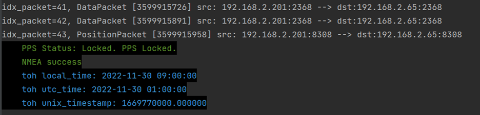
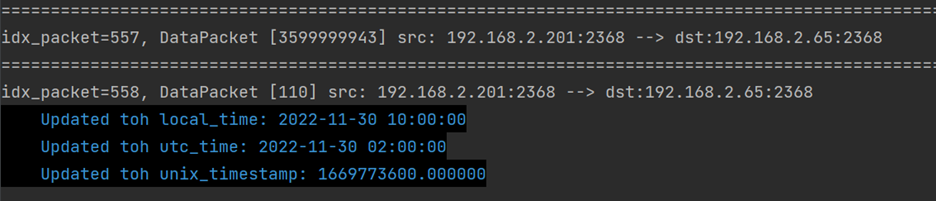
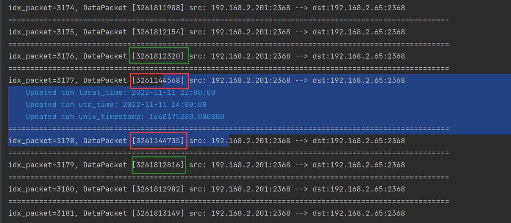
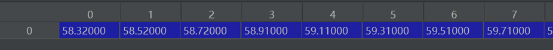
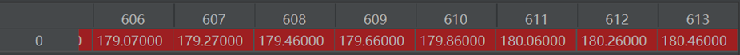
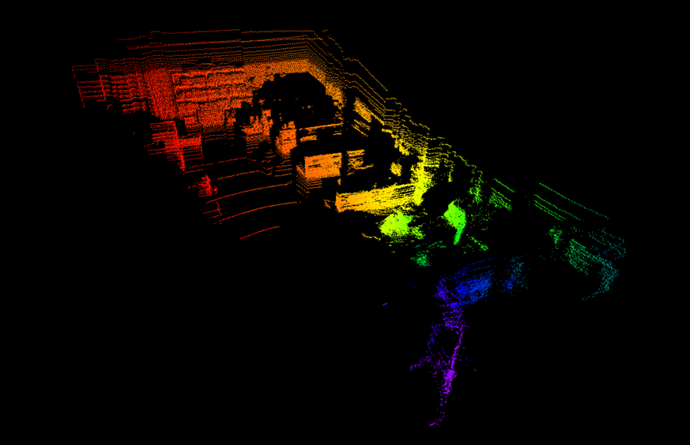
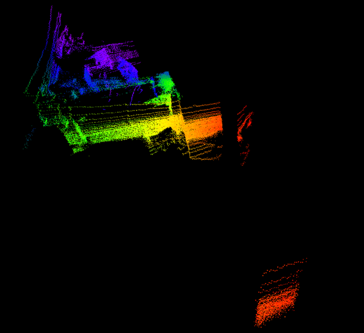
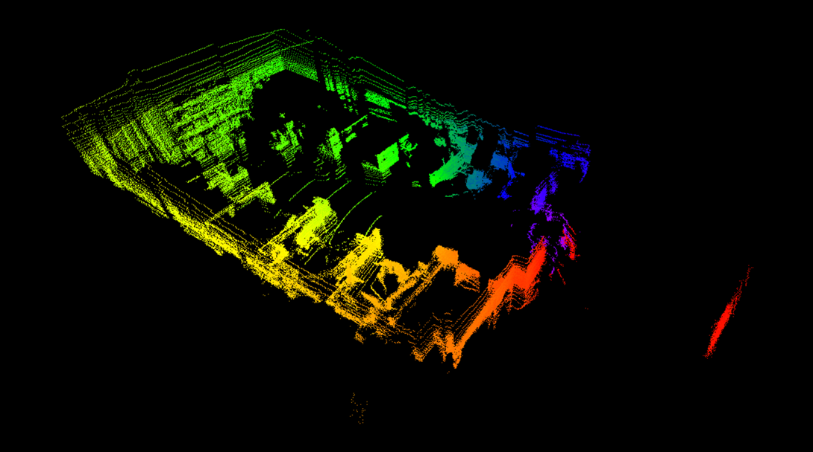
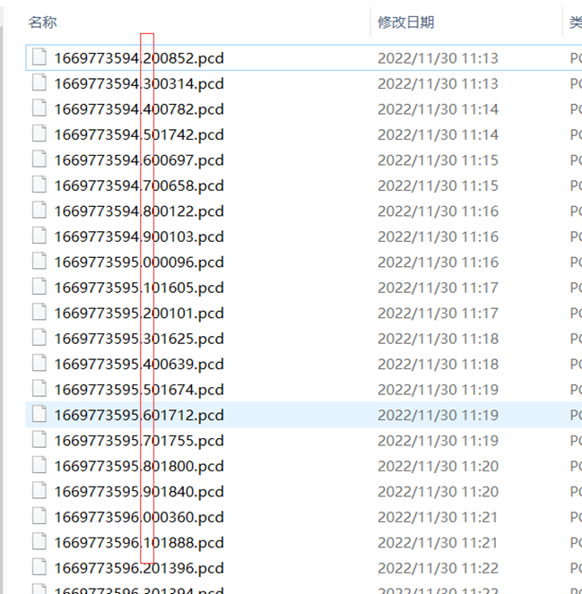

for Velodyne Alpha Prime

This project achieve:

1. Timestamp(unix) for each point
2. Customize the segmentation Angle for frames, and named frame if you like
3. pointcloud frame support .pcd, .npz

# Notes

- ## skip toh

  

  

  

- ## packet delay

  

- ## custom_frame_cut_degree

​	first frame:

​	last frame:

# Performance

